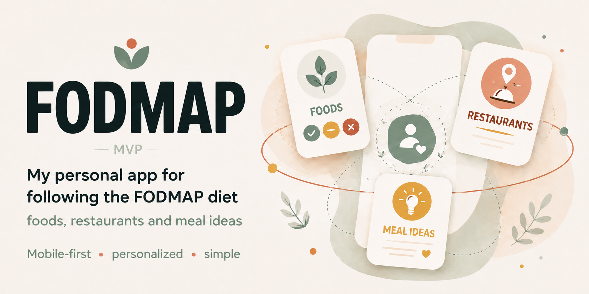

# fodmap-mvp



A personal mobile-first web app for managing a low-FODMAP / SIBO-friendly diet:
a curated food reference, a directory of approved Paris restaurants with per-meal notes to give the necessary food modification asks to the waiter, and a FODMAP reintroduction-phase tracker.

**Live:** [fodmap-mvp.vercel.app](https://fodmap-mvp.vercel.app) — passwordless magic-link login.

> Single-user app. The Supabase database holds one user's data; the auth allowlist is configured for that one email. New sign-ups create separate, isolated accounts via Row-Level Security but won't see existing data.

UI is in French.

---

## Features

**Aliments tab** — searchable list of ~40 foods, filterable by category and meal-of-day (`midi` / `soir`), color-coded green / amber / red for SIBO compatibility. Tap a food to open a detail modal with FODMAP rationale, contrainte, and markdown-rendered personal notes; the modal expands to fullscreen as you scroll into long notes. You can upload your own hero photo per food (stored in Supabase Storage).

**Restos tab** — personal directory of restaurants you've vetted:
- Name, half-star rating, address, walking-time pill (or driving-time pill, with car icon, for delivery restos), click-to-call (`tel:` link).
- Per-meal entries: name, protein category, optional half-star rating, free-text comment ("ask for sauce on the side, no garlic"). Tap a meal to edit it.
- 4-way status (`Sur place` / `À emporter` / `À tester` / `Livraison`) with distinct pills on the cards. À-tester restos appear in their own section at the bottom of the list. Map pins are colour-coded too.
- Filters: location anchor, status, protein (alphabetical, emoji-prefixed, hides empty options, shows result counts), free-text search.
- Toggle between list view and a real Google Maps view with clickable pins.

**Suggestions tab** — meal/snack ideas tagged by occasion (Petit-déj / Déj / Snack / Dîner) and context (Maison / Bureau / Resto). Multi-select chip filters, optional photo, half-star rating, "À tester" pill, plus a short `infos_cles` displayed on the card and a longer markdown `commentaire` shown only inside the detail modal.

**Tests tab** — a FODMAP reintroduction tracker. Each test is a food run over a fixed 5-day protocol (J1 100 g · J2 recovery · J3 150 g · J4 recovery · J5 200 g); on the three test days you log a digestive-comfort level (four faces, green→red) and an optional note. A list card shows the food photo and the three comfort spots; the detail view has a 5-day stepper, an editable **recipe** and an editable **"Aliments associés"** list (same-FODMAP-family foods that become safe once tolerated) — both markdown with a seed default and a "Réinitialiser" to revert. You can **add, edit, and delete** your own tests (photo upload included); the 4 starter tests are seeded on first login and are removable.

**Settings** (link in the footer) — set your bureau and domicile addresses. Saved per-user in Supabase, syncs across devices. Saving triggers a background recalc of walking *and* driving times for every existing restaurant.

UI is in French; copy uses infinitive / impersonal phrasing. A future bilingual (FR / EN) plan is documented in [`i18n-plan.md`](./i18n-plan.md).

---

## Tech stack

- **Frontend** — Vite + React 19, plain ES modules, no router (tab state in memory + localStorage)
- **Backend** — Supabase (Postgres + Auth + Row-Level Security)
- **Hosting** — Vercel, auto-deploy on push to `main`
- **Fonts** — Bricolage Grotesque (Google Fonts)

---

## Local development

```bash
git clone https://github.com/djianp/fodmap-mvp.git
cd fodmap-mvp
npm install
```

Create `.env.local` at the project root with your Supabase credentials:

```bash
VITE_SUPABASE_URL=https://<your-project-ref>.supabase.co
VITE_SUPABASE_PUBLISHABLE_KEY=sb_publishable_<your-key>
```

Both values come from Supabase: project dashboard → **Project Settings → API → Publishable and secret API keys**. Use the **publishable** key, not the secret key.

Run the dev server:

```bash
npm run dev
```

Open `http://localhost:5173`.

For local magic-link login to work, `http://localhost:5173/**` must be on the Supabase redirect URL allowlist (see [Database setup](#database-setup) below).

---

## npm scripts

| Command | What it does |
|---|---|
| `npm run dev` | Start Vite dev server with HMR on port 5173 |
| `npm run build` | Production build → `dist/` |
| `npm run preview` | Serve the production build locally |
| `npm run lint` | Run ESLint |

---

## Project structure

```
fodmap-mvp/
├── index.html                       Entry HTML (mounts <App>)
├── package.json
├── vite.config.js
├── public/                          Static assets served as-is at /
└── src/
    ├── main.jsx                     React root, StrictMode + createRoot
    ├── App.jsx                      Auth gate (Login vs AppShell) + 3-tab nav
    ├── index.css                    Phone-frame layout + .chips-scroll utility
    ├── assets/food/                 Bundled food photos (seed dataset)
    ├── components/
    │   ├── ui.jsx                   BlobLogo, Thumb, Chip, Verdict, FoodRow, IconBtn, Markdown
    │   ├── google-map.jsx           Real Google Maps view (lazy-loaded SDK)
    │   └── place-autocomplete.jsx   Custom address picker (AutocompleteSuggestion + in-flow dropdown)
    ├── data/
    │   ├── foods.js                 ~40 foods (seed only; first-login bulk insert)
    │   ├── restos.js                Seed restaurants
    │   └── reintro.js               4 seed reintro tests + recipe/associated defaults + 5-day schedule
    ├── lib/
    │   ├── supabase.js              Supabase client (reads VITE_* env vars)
    │   ├── user-data.js             Hooks + CRUD for foods / restos / meals / suggestions / reintro tests
    │   ├── user-settings.js         Pub-sub state for office / home address + recalc
    │   ├── google-maps.js           SDK loader, getRouteTimes (walk + drive), geocode
    │   ├── places-config.js         Default office / home addresses
    │   ├── storage.js               Photo upload / delete (food-photos, suggestion-photos, reintro-photos)
    │   ├── foods-meta.js            Photo URL map, categories, search helpers
    │   └── suggestions-meta.js      OCCASIONS / CONTEXTS option arrays
    └── screens/
        ├── login.jsx                Magic-link login
        ├── aliments.jsx             Foods tab + AlimentDetailModal
        ├── aliment-forms.jsx        Add / edit aliment form (photo picker)
        ├── restos.jsx               Restos tab (cards, map, modals)
        ├── resto-forms.jsx          Add resto / edit resto / meal form + shared FormShell
        ├── settings.jsx             Settings modal (office / home address)
        ├── suggestions.jsx          Suggestions tab + SuggestionDetailModal
        ├── suggestion-forms.jsx     Add / edit suggestion form
        ├── tests.jsx                Tests tab (list, detail, 5-day stepper, comfort log, editable recipe/associated sheets)
        └── tests-forms.jsx          Add / edit test form (photo upload)
```

---

## Database setup

If you ever rebuild from scratch on a new Supabase project, run this in the SQL Editor:

```sql
create table public.restos (
  id uuid primary key default gen_random_uuid(),
  user_id uuid references auth.users(id) on delete cascade not null,
  nom text not null,
  adresse text not null,
  phone text default '',
  place_id text,
  lat numeric,
  lng numeric,
  walk_min_bureau integer,
  walk_min_domicile integer,
  drive_min_bureau integer,
  drive_min_domicile integer,
  rating numeric not null check (rating >= 0 and rating <= 5),
  status text not null default 'dinein' check (status in ('takeaway', 'dinein', 'totry', 'delivery')),
  created_at timestamptz default now()
);

create table public.meals (
  id uuid primary key default gen_random_uuid(),
  resto_id uuid references public.restos(id) on delete cascade not null,
  user_id uuid references auth.users(id) on delete cascade not null,
  nom text not null,
  proteine text not null,
  rating numeric check (rating >= 0 and rating <= 5),
  comment text default '',
  created_at timestamptz default now()
);

create table public.user_settings (
  user_id uuid primary key references auth.users(id) on delete cascade,
  office_address text,
  office_lat numeric,
  office_lng numeric,
  home_address text,
  home_lat numeric,
  home_lng numeric,
  theme text not null default 'system' check (theme in ('light', 'dark', 'system')),
  updated_at timestamptz default now()
);

create table public.foods (
  id text not null,
  user_id uuid references auth.users(id) on delete cascade not null,
  nom text not null,
  cat text not null check (cat in ('Féculents','Protéines','Légumes','Fruits','Condiments')),
  midi text not null check (midi in ('green','amber','red')),
  soir text not null check (soir in ('green','amber','red')),
  note text,
  fodmap text,
  contrainte text,
  details text,
  recette text,
  photo_url text,
  tags text[] default '{}',
  created_at timestamptz default now(),
  updated_at timestamptz default now(),
  primary key (user_id, id)
);
create unique index foods_user_nom on public.foods (user_id, lower(nom));

create table public.suggestions (
  id uuid primary key default gen_random_uuid(),
  user_id uuid references auth.users(id) on delete cascade not null,
  nom text not null,
  occasions text[] not null default '{}',
  contexts text[] not null default '{}',
  rating numeric check (rating >= 0 and rating <= 5),
  infos_cles text,
  comment text,
  recette text,
  photo_url text,
  to_try boolean not null default false,
  created_at timestamptz default now(),
  updated_at timestamptz default now()
);
create index idx_suggestions_user_id on public.suggestions(user_id);

alter table public.suggestions enable row level security;
create policy "owner rw suggestions" on public.suggestions
  for all using (auth.uid() = user_id) with check (auth.uid() = user_id);

-- Free-form markdown notes (Notes tab). Standalone user content — seeded with one
-- "Le gras" note on first login (src/data/notes.js), then fully editable in-app.
create table public.notes (
  id uuid primary key default gen_random_uuid(),
  user_id uuid references auth.users(id) on delete cascade not null,
  title text not null,
  content text not null default '',
  created_at timestamptz default now(),
  updated_at timestamptz default now()
);
create index idx_notes_user_id on public.notes(user_id);

alter table public.notes enable row level security;
create policy "owner rw notes" on public.notes
  for all using (auth.uid() = user_id) with check (auth.uid() = user_id);

-- Reintroduction tests (Tests tab). Protocol DEFINITIONS are static app content
-- (src/data/reintro.js) and are NOT stored here — only the user's per-test-day
-- comfort level + note. One row per logged test day; currentDay/completed are derived.
create table public.reintro_logs (
  user_id uuid references auth.users(id) on delete cascade not null,
  protocol_id text not null,
  day integer not null check (day in (1, 3, 5)),
  comfort_level text check (comfort_level in (
    'very_good', 'slightly_bothered', 'moderately_bothered', 'very_bothered'
  )),
  note text,
  created_at timestamptz default now(),
  updated_at timestamptz default now(),
  primary key (user_id, protocol_id, day)
);
create index idx_reintro_logs_user_id on public.reintro_logs(user_id);

alter table public.reintro_logs enable row level security;
create policy "owner rw reintro_logs" on public.reintro_logs
  for all using (auth.uid() = user_id) with check (auth.uid() = user_id);

-- Per-user override of a reintroduction protocol's preparation text (markdown).
-- Absent = use the static default from src/data/reintro.js; deleting a row reverts to default.
create table public.reintro_recipes (
  user_id uuid references auth.users(id) on delete cascade not null,
  protocol_id text not null,
  recipe text,
  created_at timestamptz default now(),
  updated_at timestamptz default now(),
  primary key (user_id, protocol_id)
);
create index idx_reintro_recipes_user_id on public.reintro_recipes(user_id);

alter table public.reintro_recipes enable row level security;
create policy "owner rw reintro_recipes" on public.reintro_recipes
  for all using (auth.uid() = user_id) with check (auth.uid() = user_id);

-- Per-user markdown describing the same-FODMAP-family foods that become safe once a protocol
-- is tolerated. Absent = use the static default from src/data/reintro.js; deleting reverts to default.
create table public.reintro_category_notes (
  user_id uuid references auth.users(id) on delete cascade not null,
  protocol_id text not null,
  content text,
  created_at timestamptz default now(),
  updated_at timestamptz default now(),
  primary key (user_id, protocol_id)
);
create index idx_reintro_category_notes_user_id on public.reintro_category_notes(user_id);

alter table public.reintro_category_notes enable row level security;
create policy "owner rw reintro_category_notes" on public.reintro_category_notes
  for all using (auth.uid() = user_id) with check (auth.uid() = user_id);

-- The reintroduction tests themselves (Tests tab). Seeded with 4 defaults on first login;
-- users add/remove their own. id is a text slug shared with logs / recipes / category_notes.
create table public.reintro_protocols (
  id text not null,
  user_id uuid references auth.users(id) on delete cascade not null,
  food_name text not null,
  fodmap_family text,
  photo_url text,
  dose_day_1 text,
  dose_day_3 text,
  dose_day_5 text,
  created_at timestamptz default now(),
  updated_at timestamptz default now(),
  primary key (user_id, id)
);
create index idx_reintro_protocols_user_id on public.reintro_protocols(user_id);

alter table public.reintro_protocols enable row level security;
create policy "owner rw reintro_protocols" on public.reintro_protocols
  for all using (auth.uid() = user_id) with check (auth.uid() = user_id);

-- One row per user: the curated "Statut actuel" summary above the test list.
create table public.reintro_status (
  user_id uuid references auth.users(id) on delete cascade not null,
  validated text,
  upcoming text,
  avoid text,
  detail text,
  updated_at timestamptz default now(),
  primary key (user_id)
);

alter table public.reintro_status enable row level security;
create policy "owner rw reintro_status" on public.reintro_status
  for all using (auth.uid() = user_id) with check (auth.uid() = user_id);

create index idx_restos_user_id on public.restos(user_id);
create index idx_meals_resto_id on public.meals(resto_id);
create index idx_meals_user_id on public.meals(user_id);

alter table public.restos enable row level security;
create policy "owner rw restos" on public.restos
  for all using (auth.uid() = user_id) with check (auth.uid() = user_id);

alter table public.meals enable row level security;
create policy "owner rw meals" on public.meals
  for all using (auth.uid() = user_id) with check (auth.uid() = user_id);

alter table public.foods enable row level security;
create policy "owner rw foods" on public.foods
  for all using (auth.uid() = user_id) with check (auth.uid() = user_id);

alter table public.user_settings enable row level security;
create policy "owner rw user_settings" on public.user_settings
  for all using (auth.uid() = user_id) with check (auth.uid() = user_id);
```

Then create the two public storage buckets used for user-uploaded photos:

```sql
insert into storage.buckets (id, name, public)
values ('food-photos', 'food-photos', true),
       ('suggestion-photos', 'suggestion-photos', true),
       ('reintro-photos', 'reintro-photos', true)
on conflict (id) do nothing;

create policy "owner can write food photos" on storage.objects
  for insert to authenticated
  with check (bucket_id = 'food-photos' and (storage.foldername(name))[1] = auth.uid()::text);
create policy "owner can update food photos" on storage.objects
  for update to authenticated
  using (bucket_id = 'food-photos' and (storage.foldername(name))[1] = auth.uid()::text);
create policy "owner can delete food photos" on storage.objects
  for delete to authenticated
  using (bucket_id = 'food-photos' and (storage.foldername(name))[1] = auth.uid()::text);
create policy "anyone can read food photos" on storage.objects
  for select to public
  using (bucket_id = 'food-photos');

create policy "owner can write suggestion photos" on storage.objects
  for insert to authenticated
  with check (bucket_id = 'suggestion-photos' and (storage.foldername(name))[1] = auth.uid()::text);
create policy "owner can update suggestion photos" on storage.objects
  for update to authenticated
  using (bucket_id = 'suggestion-photos' and (storage.foldername(name))[1] = auth.uid()::text);
create policy "owner can delete suggestion photos" on storage.objects
  for delete to authenticated
  using (bucket_id = 'suggestion-photos' and (storage.foldername(name))[1] = auth.uid()::text);
create policy "anyone can read suggestion photos" on storage.objects
  for select to public
  using (bucket_id = 'suggestion-photos');

create policy "owner can write reintro photos" on storage.objects
  for insert to authenticated
  with check (bucket_id = 'reintro-photos' and (storage.foldername(name))[1] = auth.uid()::text);
create policy "owner can update reintro photos" on storage.objects
  for update to authenticated
  using (bucket_id = 'reintro-photos' and (storage.foldername(name))[1] = auth.uid()::text);
create policy "owner can delete reintro photos" on storage.objects
  for delete to authenticated
  using (bucket_id = 'reintro-photos' and (storage.foldername(name))[1] = auth.uid()::text);
create policy "anyone can read reintro photos" on storage.objects
  for select to public
  using (bucket_id = 'reintro-photos');
```

Each user's photos live under their own `<user_id>/…` folder; only that user can write or delete them, but the URLs are publicly readable so the app can render them without signed URLs.

Then configure auth URLs at **Authentication → URL Configuration**:

- **Site URL** — the production URL (e.g. `https://fodmap-mvp.vercel.app`)
- **Redirect URLs** — both production and dev:
  - `http://localhost:5173/**`
  - `https://fodmap-mvp.vercel.app/**`

On a new user's first login, three seed sets are bulk-inserted into their account by routines in `src/lib/user-data.js`:

- `seedRestos()` — Paris restaurants from `src/data/restos.js`, including Google `place_id`, lat/lng, and pre-computed walking minutes so the map works immediately.
- `seedFoods()` — the curated food entries from `src/data/foods.js`, fully editable and extendable from the Aliments tab thereafter.
- `seedReintroProtocols()` — the 4 default reintroduction tests from `src/data/reintro.js` (reusing their slug ids so any existing logs/recipes/notes stay linked); add/edit/delete from the Tests tab thereafter. Their recipe/associated-foods defaults stay in code, resolved by slug id.

A separate env var, `VITE_GOOGLE_MAPS_API_KEY`, is required for the map view, the Places-Autocomplete-driven add-resto form, and the walking-time computation. See `CLAUDE.md` for the required API restrictions.

---

## Deployment

Vercel auto-deploys on every push to `main`. No CI config in the repo — Vercel detects Vite from `package.json` and runs `npm run build` itself.

Environment variables required in Vercel **Project Settings → Environment Variables**:

- `VITE_SUPABASE_URL`
- `VITE_SUPABASE_PUBLISHABLE_KEY`

Set both for **Production**, **Preview**, and **Development** environments.

After adding the production URL to Supabase's redirect allowlist, magic-link login works on the live site.

---

## Notes for future-me

See [`FOR PIERRE.md`](./FOR%20PIERRE.md) for a longer narrative write-up: why the project is structured this way, the bugs hit during development, and the lessons.

For one-line architecture: **GitHub stores it. Vercel serves it. Supabase remembers it.**
